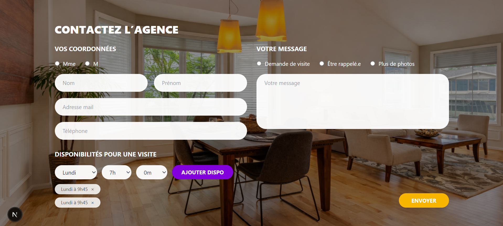

# Test technique – Formulaire de contact immobilier

## À propos de moi

- **Nom / prénom :** Lydia Hallaf  
- **Formation :** Master 1 MIAGE (Méthodes Informatiques Appliquées à la Gestion des Entreprises) à luniversité d'Aix-Marseille 
- **Durée de stage souhaitée :** de 2 à 4 mois 

## Screenshot



## Stack technique & choix

- **Framework :** Next.js (React)
  → Permet de gérer à la fois le front-end et une API backend dans le même projet.

- **React**
  → Gestion dynamique du formulaire avec `useState`.

- **Tailwind CSS**
  → Permet de créer rapidement une interface responsive avec des classes utilitaires.

- **mysql2**
  → Permet de connecter facilement l’application à une base de données MySQL.

- **XAMPP (Apache + MySQL)**
  → Utilisé pour exécuter la base de données en local.

---

## Fonctionnalités réalisées

- Intégration du formulaire à partir de la maquette
- Responsive (mobile / desktop)
- Gestion dynamique des champs avec `useState`
- Ajout / suppression de disponibilités
- Envoi des données via une API Next.js
- Enregistrement en base de données MySQL
- Message de succès après envoi

---

## Sécurité / bonnes pratiques

- Validation des champs obligatoires
- Vérification du format de l’email
- Utilisation de requêtes préparées (anti SQL injection)
- Variables d’environnement pour la configuration

---

## Structure du projet

```
app/
  api/
    contact/
      route.js
  globals.css
  layout.tsx
  page.tsx

components/
  ContactForm.jsx
  Input.jsx
  RadioGroup.jsx
  Availability.jsx

lib/
  db.js

public/
  bg.jpg
```

---

## Installation et lancement en local

### 1. Cloner le projet

```bash
git clone https://github.com/Lydia3100/contact-form-agence.git
cd contact-form-agence
```

### 2. Installer les dépendances

```bash
npm install
```

### 3. Configurer les variables d’environnement

Créer un fichier `.env.local` à la racine du projet :

```env
DB_HOST=localhost
DB_USER=root
DB_PASSWORD=
DB_NAME=contact_agence
```

### 4. Démarrer XAMPP

Lancer :

- Apache
- MySQL

### 5. Créer la base de données

Dans phpMyAdmin :

```sql
contact_agence
```

Puis :

```sql
CREATE TABLE contacts (
  id INT AUTO_INCREMENT PRIMARY KEY,
  civilite VARCHAR(10),
  nom VARCHAR(100) NOT NULL,
  prenom VARCHAR(100) NOT NULL,
  email VARCHAR(150) NOT NULL,
  telephone VARCHAR(30),
  type_message VARCHAR(100),
  message TEXT NOT NULL,
  disponibilites TEXT,
  created_at TIMESTAMP DEFAULT CURRENT_TIMESTAMP
);
```

### 6. Lancer le projet

```bash
npm run dev
```

Puis ouvrir :

http://localhost:3000

---

## Test du fonctionnement

1. Remplir le formulaire  
2. Cliquer sur Envoyer  
3. Vérifier le message de succès  
4. Aller dans phpMyAdmin  
5. Vérifier que les données sont bien enregistrées  

## Questions

### Avez-vous trouvé l’exercice facile ou difficile ?

J’ai trouvé l’exercice globalement accessible, notamment la partie front-end que je maîtrisais déjà.  
La principale difficulté a été la découverte de Next.js, en particulier la mise en place des API routes.

---

### Qu’est-ce qui vous a posé problème ?

La principale difficulté a été la mise en place de l’API avec Next.js, que je n’avais jamais utilisé auparavant.  
Comprendre la logique des routes côté serveur et l’organisation du projet a demandé un temps d’adaptation.

---

### Avez-vous appris de nouveaux outils ?

Oui, cet exercice m’a permis de découvrir Next.js, notamment pour créer une API backend directement dans le projet.  
J’ai également mieux compris comment structurer une application fullstack.

---

### Quelle est la place du développement web dans votre cursus de formation ?

Le développement web fait partie de ma formation en MIAGE, principalement à travers des travaux pratiques.  
Cela m’a permis d’acquérir des bases en front-end et de comprendre le fonctionnement global d’une application web.

---

### Avez-vous utilisé un LLM ?

Oui, j’ai utilisé un LLM (ChatGPT) comme support ponctuel.

Il m’a aidée à :
- débloquer certaines erreurs techniques
- mieux comprendre le fonctionnement de Next.js
Cependant, j’ai veillé à bien comprendre les solutions proposées et à les adapter moi-même.  
L’IA a été utilisée comme un outil d’accompagnement pour optimiser mon travail, et non comme un substitut au développement.
---

## Auteur

Lydia Hallaf
